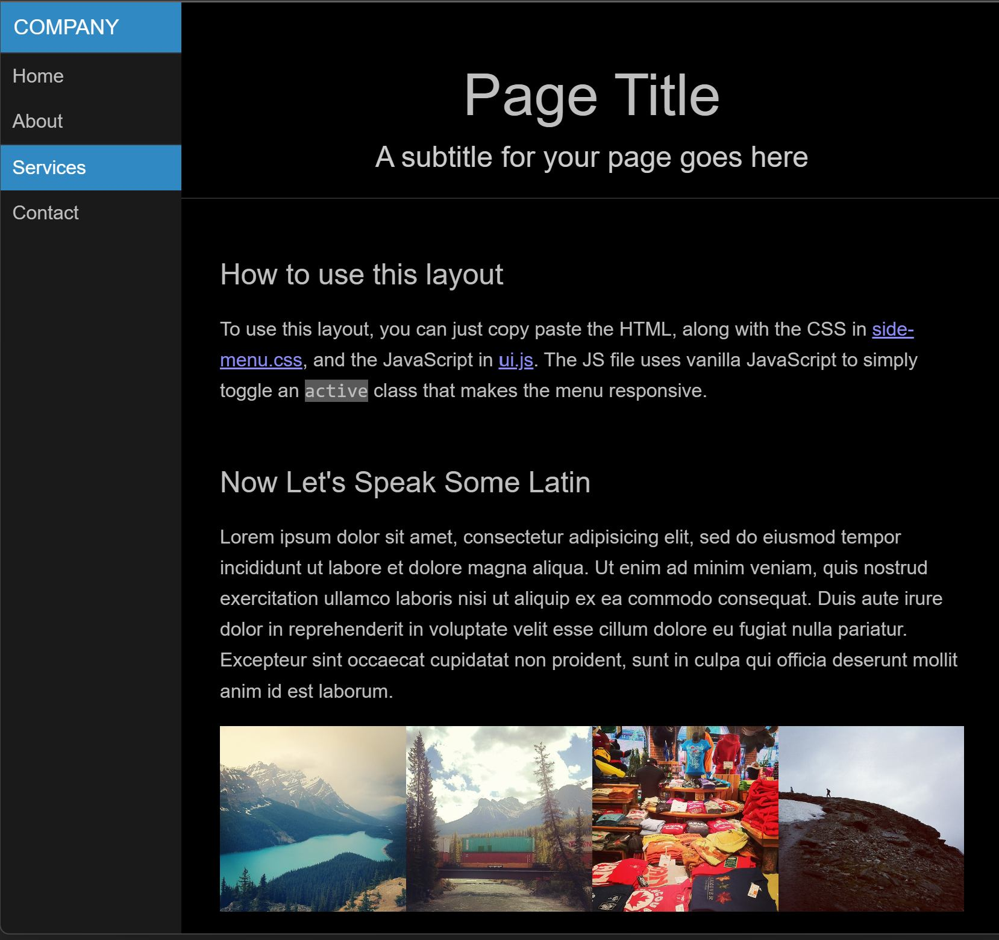
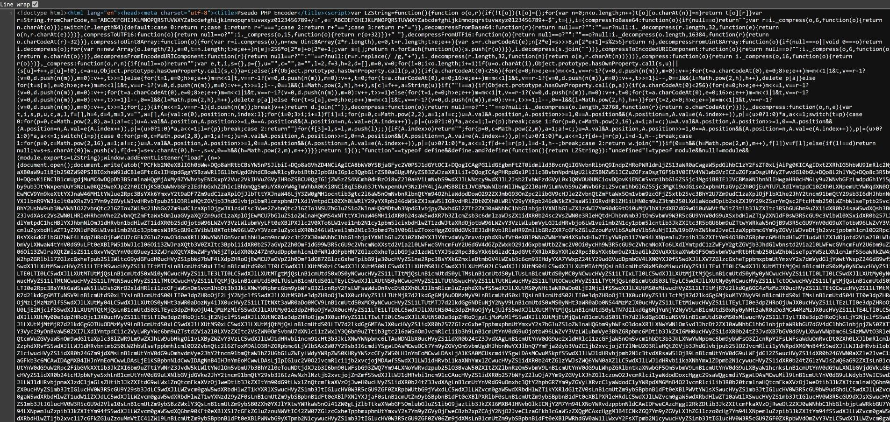

Niniejszy plik _README_ został przetłumaczony na język polski dla wygody użytkowników. Jednak wszystkie strony internetowe, do których odnośniki zawiera, są w języku angielskim. [Licencja](LICENSE.md) też jest po angielsku. Przynajmniej podstawowa znajomość języka angielskiego jest niezbędna, by zainstalować i korzystać z tego pakietu.

(_The README file has been translated into Polish for the convenience of users. However, all websites it links to are in English. [License file](LICENSE.md)  is also in English. At least a basic knowledge of English is required to install and use of this package_)

    
    <h1 align="center">Pseudo-Enkoder PHP</h1>

Inspiracja:

- [IonCube / PHP Encoder 12](https://www.ioncube.com/php_encoder.php?page=pricing), 
- [Adminer](https://www.adminer.org/en/) (częściowe kodowanie głównego pliku)

Pomysł wykorzystuje:

- [Yii 2 Micro Framework](https://www.yiiframework.com/doc/guide/2.0/en/tutorial-yii-as-micro-framework) 
- oraz bibliotekę [LZ-based compression algorithm for JavaScript](https://github.com/pieroxy/lz-string/).

Idea polega na tym, by przeglądarka wyświetlała użytkownikowi w pełni funkcjonalną stronę WWW (z pełnym stylowaniem opartym o CSS i działającą logiką, opartą na JavaScript), jednocześnie zawierając "bagno" w kodzie źródłowym.

Dodatkowym założeniem jest, żeby wszystko było zbudowane na _one-linerze_, czyli zawarte w jednym pliku.

## WYMAGANIA

Poniższe komponenty są wymagane i muszą zostać zainstalowane (jeśli już ich nie posiadasz):

1. Lokalny serwer webowy typu LAMP. [XAMPP](https://www.apachefriends.org/index.html) jest polecany. Ewentualnie samodzielny interpreter języka PHP.
2. System kontroli zależności [Composer](http://getcomposer.org/).
3. [Git dla Windows](https://gitforwindows.org/).
4. Dowolna przeglądarka internetowa we w miarę nowej wersji.

Rozwiązanie było testowane wyłącznie w systemie **Windows 11 Pro**, pod kontrolą **PHP 8.2.4**.

## Instalacja

### XAMPP

Jeśli nie posiadasz zainstalowanego [XAMPPa](https://www.apachefriends.org/index.html), lub dowolnego innego pakietu serwerowego typu LAMP, możesz pobrać i zainstalować go ze strony internetowej [ApacheFriends.org](https://www.apachefriends.org/download.html).

Jeśli wybierzesz gałąź 8.1 lub 8.0, konieczne będzie użycie flagi `--ignore-platform-req=php` przy korzystaniu z Composera, jak to opisano poniżej i [tutaj](https://forum.yiiframework.com/t/current-version-of-yii-2-not-ready-for-php-8-2/135156/2?u=trejder).

### Git for Windows

Jeśli nie masz jeszcze [Git for Windows](https://gitforwindows.org/) lub innej wersji gita, możesz pobrać go z ich [strony głównej](https://gitforwindows.org/).

### Composer

Jeśli nie posiadasz [Composera](http://getcomposer.org/), instrukcje instalacji znajdziesz na stronie WWW
 [getcomposer.org](http://getcomposer.org/doc/00-intro.md#installation-nix).

### Pobierz projekt przy pomocy Gita i Composer

Wykonaj poniższe polecenia w konsoli Windows:

~~~
git clone git@github.com:telecare-poland/test-algorytmu-base64.git
composer update --ignore-platform-req=php
~~~

Flaga `--ignore-platform-req=php` musi być użyta tylko, jeśli masz zainstalowane [PHP w wersji 8.2 lub nowszej](https://forum.yiiframework.com/t/current-version-of-yii-2-not-ready-for-php-8-2/135156/2?u=trejder).

## URUCHOMIENIE

Uruchom swój serwer lokalny lub wykorzystaj serwer wbudowany w PHP:

~~~
cd htdocs/test-algorytmu-base64
php yii serve
~~~

Następnie uruchom wybraną przeglądarkę i przejdź pod adres [`http://localhost:8080`](http://localhost:8080).

## KONFIGURACJA

1. Otwórz stronę dowolnego konwertera base64, np. [Base64 Converter](https://base64.guru/converter).
2. Wkej dowolny kod HTML i dokonaj jego konwersji na base64.
3. Zamień **całą zawartość** pliku `views/site/index.php` na wygenerowany łańcuch tekstowy.

Na przykład, zamień takie coś:

    <h2>Base64 Converter</h2>
    <h3>The Base64 online converter supports both functions of the algorithm on same page. If you need to encode a text to Base64, fill in the Text field and press Encode text to Base64 -- the result will appear in the Base64 field. Otherwise, if you have a Base64 string, paste it into the Base64 field and press Decode Base64 to text -- the result will appear in the Text field.<h3>
    <h2>About Base64 online converter</h2>
    <h3>Please note that this Base64 converter supports only main standard and decodes the data in strict mode. Perhaps this option does not suit your needs, and you want to encode text or decode Base64 using other variations of this algorithm. If so, please check the following online convertors. They are also simple and free, but they are sharpened for certain tasks.<h3>

Na coś takiego:

    PGgxPkJhc2U2NCBDb252ZXJ0ZXI8L2gyPg0KPGgzPlRoZSBCYXNlNjQgb25saW5lIGNvbnZlcnRlciBzdXBwb3J0cyBib3RoIGZ1bmN0aW9ucyBvZiB0aGUgYWxnb3JpdGhtIG9uIHNhbWUgcGFnZS4gSWYgeW91IG5lZWQgdG8gZW5jb2RlIGEgdGV4dCB0byBCYXNlNjQsIGZpbGwgaW4gdGhlIFRleHQgZmllbGQgYW5kIHByZXNzIEVuY29kZSB0ZXh0IHRvIEJhc2U2NCAtLSB0aGUgcmVzdWx0IHdpbGwgYXBwZWFyIGluIHRoZSBCYXNlNjQgZmllbGQuIE90aGVyd2lzZSwgaWYgeW91IGhhdmUgYSBCYXNlNjQgc3RyaW5nLCBwYXN0ZSBpdCBpbnRvIHRoZSBCYXNlNjQgZmllbGQgYW5kIHByZXNzIERlY29kZSBCYXNlNjQgdG8gdGV4dCAtLSB0aGUgcmVzdWx0IHdpbGwgYXBwZWFyIGluIHRoZSBUZXh0IGZpZWxkLjxoMz4NCjxoMj5BYm91dCBCYXNlNjQgb25saW5lIGNvbnZlcnRlcjwvaDI+DQo8aDM+UGxlYXNlIG5vdGUgdGhhdCB0aGlzIEJhc2U2NCBjb252ZXJ0ZXIgc3VwcG9ydHMgb25seSBtYWluIHN0YW5kYXJkIGFuZCBkZWNvZGVzIHRoZSBkYXRhIGluIHN0cmljdCBtb2RlLiBQZXJoYXBzIHRoaXMgb3B0aW9uIGRvZXMgbm90IHN1aXQgeW91ciBuZWVkcywgYW5kIHlvdSB3YW50IHRvIGVuY29kZSB0ZXh0IG9yIGRlY29kZSBCYXNlNjQgdXNpbmcgb3RoZXIgdmFyaWF0aW9ucyBvZiB0aGlzIGFsZ29yaXRobS4gSWYgc28sIHBsZWFzZSBjaGVjayB0aGUgZm9sbG93aW5nIG9ubGluZSBjb252ZXJ0b3JzLiBUaGV5IGFyZSBhbHNvIHNpbXBsZSBhbmQgZnJlZSwgYnV0IHRoZXkgYXJlIHNoYXJwZW5lZCBmb3IgY2VydGFpbiB0YXNrcy48aDM+

(kod base64 musi być wklejony w _jednej linijce_)

Zapisz zmiany w pliku `views/site/index.php`, wróć do przeglądarki i odśwież stronę [`http://localhost:8080`](http://localhost:8080).

## PRZYKŁAD

Jeśli wszystko poszło zgodnie z planem, w przeglądarce powinna pojawić się przykładowa strona WWW:

To jest normalna, w pełni działąjąca strona WWW (która wykorzystuje HTML, CSS i JavaScript). Nawet pomimo faktu, że jeśli naciśniesz <kbd>Ctrl</kbd>+<kbd>U</kbd>, by wyświetlić źródło strony, zobaczysz coś podobnego do tego:

Czyli kompletne bagno.

## UWAGI KOŃCOWE

Przykładowa strona WWW (powyżej) jest oparta na [Pure](https://purecss.io/).

Wykorzystano przykład z folderu [`pure/site/static/layouts/side-menu/`](https://github.com/pure-css/pure/tree/master/site/static/layouts/side-menu). Dokonano jedynie zmiany, polegającej na tym, że każdy wymagany zewnętrzny plik został osadzony bezpośrednio w pliku [`index.html`](https://github.com/telecare-poland/test-algorytmu-base64/blob/main/source/side-menu-oneliner/index.html).

Treść strony została następnie zakodowana (przy użyciu [Base64 Converter](https://base64.guru/converter)) i umieszczona w pliku [`views\site\index.php`](https://github.com/telecare-poland/test-algorytmu-base64/blob/main/views/site/index.php).

Wykorzystane źródła (wersja oryginalna i przerobiona do _jedno-linijkowca_) są w folderze [`source`](https://github.com/telecare-poland/test-algorytmu-base64/tree/main/source) w tym repozytorium.